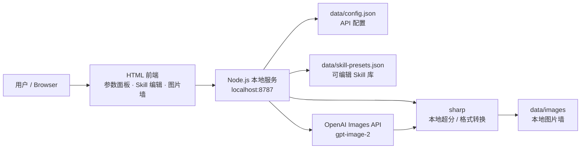

<div align="center">

# Image2 Local Studio

> 把 GPT Image 2 变成本地可控的生图工作台。

**Node.js + HTML 本地 API 生图工具，内置中文 Prompt Skill 库、参数面板、4K 超分和图片墙。**
<br>
API Key 保存在本机，浏览器只访问本地服务。
<br><br>

<a href="https://github.com/Iroha-P/image2-local-studio">
  
</a>


<a href="#features--功能亮点">功能亮点</a> ·
<a href="#quick-start--快速开始">快速开始</a> ·
<a href="#resolution--尺寸与超分">尺寸与超分</a> ·
<a href="#prompt-skills--中文-skill-库">Skill 库</a> ·
<a href="#project-structure--项目结构">项目结构</a>

</div>

> **本项目是本地工具，不是云端托管生图服务。** GitHub Pages 只用于展示项目主页；真正的生图 API 需要在本机或支持 Node.js 的服务器上运行。OpenAI API Key 会保存到本地 `data/config.json`，请勿把该文件提交到公开仓库。

---

## Features / 功能亮点

- **本地 API 代理** — 前端只请求本地 Node 服务，避免把 API Key 写进浏览器直连外部 API 的代码里
- **参数控制面板** — 模型、官方原生尺寸、质量、背景、格式、压缩、审核策略都能在界面调整
- **1K 到 4K 工作流** — 按官方尺寸生成，再用本地 `sharp` 超分保存为 2K、4K 或自定义尺寸
- **图片墙管理** — 生成结果自动保存到 `data/images`，支持预览、下载和删除
- **中文 Prompt Skill 库** — 同步 YouMind 中文 README，并接入 EvoLinkAI 场景，当前本地库 333 个 Skill
- **Skill 可编辑** — 新增、命名、修改说明、修改 Prompt、修改预览图、保存、删除、重置
- **一键翻译 Skill** — 对仍是英文的 Skill，可用已保存的 OpenAI API Key 翻译为简体中文
- **项目主页** — `docs/index.html` 可通过 GitHub Pages 发布为静态介绍页

---

## Architecture / 系统架构



---

## Quick Start / 快速开始

### 方式 A：一键启动

双击：

```text
start.bat
```

首次启动会自动安装本地超分依赖 `sharp`。启动成功后打开：

```text
http://localhost:8787
```

### 方式 B：命令行启动

```powershell
npm install
npm start
```

---

## Usage / 使用流程

1. 在左侧 API 面板填写 OpenAI API Key，点击 **保存**。
2. 选择 **官方原生尺寸**，再选择 **最终导出尺寸**。
3. 调整质量、背景、格式、压缩、审核等参数。
4. 在 Prompt Skill 面板选择场景，查看预览图。
5. 如果是英文 Skill，点击 **翻译中文**。
6. 点击 **调用**，把 Skill Prompt 填入主提示词框。
7. 点击 **生成图片**，结果会保存到图片墙。
8. 在图片墙中预览、下载或删除图片。

---

## Resolution / 尺寸与超分

OpenAI 官方 `images/generations` 当前可用的原生尺寸为：

- `auto`
- `1024x1024`
- `1024x1536`
- `1536x1024`

Image2 Local Studio 把尺寸分成两层：

| 层级 | 作用 |
|---|---|
| 官方原生尺寸 | 真实传给 OpenAI API 的 `size` |
| 最终导出尺寸 | 本地保存前的目标尺寸，由 `sharp` 处理 |

因此 4K 不是强行传给官方 API，而是在官方图生成成功后做本地超分。

---

## Prompt Skills / 中文 Skill 库

Skill 数据来源：

- [YouMind-OpenLab/awesome-gpt-image-2](https://github.com/YouMind-OpenLab/awesome-gpt-image-2) — CC BY 4.0
- [EvoLinkAI/awesome-gpt-image-2-API-and-Prompts](https://github.com/EvoLinkAI/awesome-gpt-image-2-API-and-Prompts) — CC0 1.0

同步命令：

```powershell
npm run sync-skills
```

同步逻辑：

- YouMind 优先读取 `README_zh.md`
- EvoLinkAI 优先读取 `README_zh-CN.md`
- 自动抽取 `No.` / `Case` 场景、Prompt 代码块和预览图链接
- 写入 `data/skill-presets.json`

说明：YouMind 的中文 README 包含中文 Prompt；EvoLinkAI 的中文 README 中仍有不少英文 Case/Prompt。遇到看不懂的英文 Skill，可以在页面点击 **翻译中文**。

---

## Project Homepage / 项目主页

项目主页文件：

```text
docs/index.html
```

GitHub Pages 地址：

[https://iroha-p.github.io/image2-local-studio/](https://iroha-p.github.io/image2-local-studio/)

> GitHub Pages 只能托管静态主页，不能直接运行 Node.js 生图服务。

---

## Project Structure / 项目结构

```text
image2-local-studio/
├─ public/                     # 前端页面、样式、交互脚本
│  ├─ index.html
│  ├─ app.js
│  ├─ styles.css
│  └─ skill-previews/
├─ server/                     # Node.js 本地 API 服务
│  ├─ index.js
│  └─ skill-sync.js
├─ skills/awesome-gpt-image-2/ # 内置轻量 Skill 模板
├─ scripts/                    # 启动、同步、授权辅助脚本
├─ docs/                       # GitHub Pages 静态主页
├─ data/                       # 本地配置、Skill、图片索引
├─ start.bat                   # Windows 一键启动
└─ package.json
```

`data/config.json`、`data/images/` 等本地私有或生成内容已被 `.gitignore` 忽略。

---

## API Reference / OpenAI 图像接口

服务默认调用：

```text
POST https://api.openai.com/v1/images/generations
```

默认模型：

```text
gpt-image-2
```

官方文档：

- [Image generation guide](https://platform.openai.com/docs/guides/image-generation)
- [Images API reference](https://platform.openai.com/docs/api-reference/images/create)
